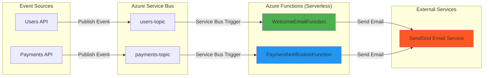

# ⚡ FCG-Functions - Serverless Event Processors

> **Azure Functions** - Processamento serverless e event-driven para o ecossistema FCG Games

[](https://azure.microsoft.com/services/functions/)
[](https://dotnet.microsoft.com/)
[](https://aws.amazon.com/serverless/)
[](https://docs.microsoft.com/azure/architecture/guide/architecture-styles/event-driven)

## 🎯 O que é este projeto?

**FCG-Functions** é a camada **serverless** da arquitetura FCG Games, implementando **Azure Functions** para processar eventos assíncronos e executar tarefas computacionalmente isoladas. Este projeto demonstra **arquitetura event-driven**, **desacoplamento** e **escalabilidade automática** sem gerenciamento de infraestrutura.

### Por que Serverless?
- ✅ **Custo Zero em Idle**: Pague apenas pelos milissegundos executados
- ✅ **Auto-Scaling**: Escala automaticamente de 0 a milhares de instâncias
- ✅ **Foco no Código**: Zero manutenção de servidores/containers
- ✅ **Desacoplamento Total**: Consumidores independentes dos produtores de eventos

---

## 🚀 Tecnologias e Padrões Aplicados

### Stack Técnico
| Tecnologia | Propósito | Conceito Aplicado |
|------------|-----------|-------------------|
| **Azure Functions v4** | Runtime Serverless | FaaS (Function as a Service) |
| **.NET 8 Isolated Worker** | Runtime do .NET | Processo isolado, melhor performance |
| **Azure Service Bus Trigger** | Event Consumption | Message-Driven Architecture |
| **SendGrid API** | Email Transacional | Third-party Integration |
| **Azure Storage** | State Management | Serverless State Persistence |

### Padrões Arquiteturais Implementados

#### ☁️ **Serverless Architecture**
- **Function per Feature**: Uma função = Uma responsabilidade
- **Stateless Execution**: Funções sem estado, dados via triggers
- **Event-Driven**: 100% reativo a eventos de Service Bus

#### 📬 **Asynchronous Messaging**
- **Service Bus Triggers**: Consumo automático de tópicos
- **Dead Letter Queue**: Mensagens problemáticas isoladas automaticamente
- **At-Least-Once Delivery**: Garantia de processamento com idempotência

#### 🔌 **Integration Patterns**
- **Anti-Corruption Layer**: Funções isolam lógica de email de domínio de negócio
- **Saga Pattern (Futuro)**: Orquestração de transações distribuídas

---

## 📋 Funções Implementadas

### 📧 **WelcomeEmailFunction**
**Trigger**: `users-topic` (UserCreatedEvent)  
**Ação**: Envia email de boas-vindas via SendGrid  
**Idempotência**: Verifica se email já foi enviado antes de processar

```csharp
[Function("WelcomeEmailFunction")]
public async Task Run(
    [ServiceBusTrigger("users-topic", "email-subscription")] 
    UserCreatedEvent @event)
{
    await _emailService.SendWelcomeEmailAsync(@event.Email);
}
```

### 💳 **PaymentNotificationFunction** *(Planejada)*
**Trigger**: `payments-topic` (PaymentProcessedEvent)  
**Ação**: Notifica usuário sobre status do pagamento  
**Retry Policy**: Exponential backoff em caso de falha

---

## ⚙️ Configuração e Deploy

### Pré-requisitos
```powershell
# Instalar Azure Functions Core Tools
npm install -g azure-functions-core-tools@4

# Instalar Azure CLI
winget install Microsoft.AzureCLI
```

### Configuração Local

**local.settings.json**:
```json
{
  "IsEncrypted": false,
  "Values": {
    "AzureWebJobsStorage": "UseDevelopmentStorage=true",
    "FUNCTIONS_WORKER_RUNTIME": "dotnet-isolated",
    "ServiceBusConnection": "<connection-string-do-service-bus>",
    "SendGridApiKey": "<sua-api-key-sendgrid>"
  }
}
```

### Executar Localmente
```powershell
cd FCG-Functions
func start
```

### Deploy no Azure
```powershell
# Login no Azure
az login

# Deploy da Function App
func azure functionapp publish fcg-functions

# Verificar logs
func azure functionapp logstream fcg-functions
```

### Variáveis de Ambiente (Azure Portal)

| Variável | Descrição | Onde Obter |
|----------|-----------|------------|
| `AzureWebJobsStorage` | Storage Account para estado da função | Azure Storage Connection String |
| `ServiceBusConnection` | Connection string do Service Bus | Azure Service Bus → Shared Access Policies |
| `SendGridApiKey` | Chave da API SendGrid | SendGrid Dashboard → API Keys |

---

## 🏛️ Arquitetura - Diagrama Mermaid



---

## 🧪 Testando as Funções

### Testar WelcomeEmailFunction Localmente

1. **Publique um evento manualmente no Service Bus**:
```powershell
# Usando Azure CLI
az servicebus topic message send `
  --resource-group fcg-microsservices `
  --namespace-name fcg-azure-servicebus `
  --topic-name users-topic `
  --body '{"userId":"123","email":"teste@example.com","createdAt":"2026-01-09T00:00:00Z"}'
```

2. **Monitore os logs da função**:
```powershell
func start --verbose
```

3. **Verifique o email recebido** no inbox do destinatário.

---

## 📊 Observabilidade e Monitoramento

### Application Insights (Recomendado)
```json
// Adicionar ao local.settings.json
{
  "APPLICATIONINSIGHTS_CONNECTION_STRING": "<connection-string>"
}
```

### Logs Estruturados
```csharp
_logger.LogInformation(
    "Email enviado para {Email} | CorrelationId: {CorrelationId}",
    @event.Email,
    @event.CorrelationId
);
```

### Métricas Importantes
- **Execution Count**: Número de execuções por função
- **Execution Duration**: Tempo médio de processamento
- **Failure Rate**: Taxa de falhas/retries
- **Dead Letter Messages**: Mensagens que falharam definitivamente

---

## 🎓 Conceitos Avançados Aplicados

### **Cold Start Mitigation**
- Premium Plan para funções críticas (sempre quente)
- Durable Functions para workflows longos

### **Idempotency**
- Verificação de duplicatas antes de processar
- Uso de MessageId como deduplication key

### **Retry Policies**
- Exponential Backoff configurado
- Maximum Delivery Count = 10
- Dead Letter Queue automático

---

## 📚 Referências Técnicas

- [Azure Functions Documentation](https://docs.microsoft.com/azure/azure-functions/)
- [Service Bus Triggers](https://docs.microsoft.com/azure/azure-functions/functions-bindings-service-bus-trigger)
- [Serverless Architectures (AWS Whitepaper)](https://d1.awsstatic.com/whitepapers/serverless-architectures-with-aws-lambda.pdf)
- [SendGrid .NET SDK](https://github.com/sendgrid/sendgrid-csharp)
